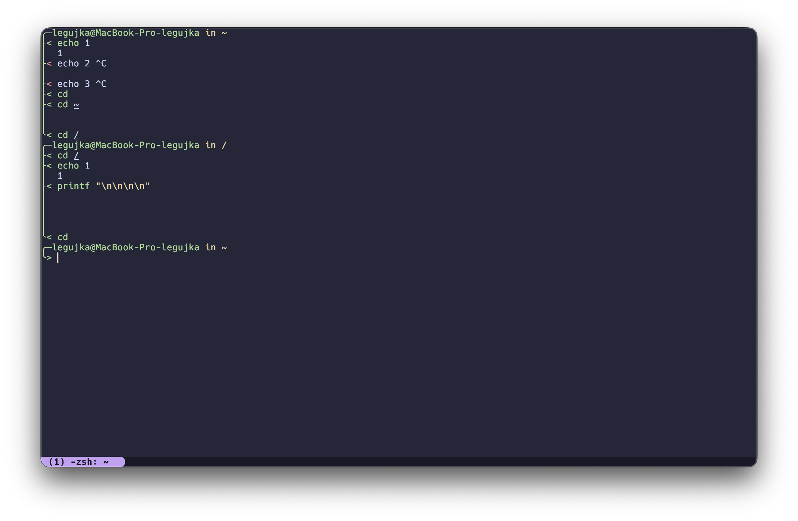

# PIPED-STRUG

## Preview



## Overview

Custom `strug` zsh theme interpretation with piped structure based on current context by current path or branch

> [!WARNING]  
> This theme is still under development and has many bugs and shortcomings, use with caution
> Was tested only on MacOS

## Features

- Nice piped structure based on context
- Fully AI-written bs
- Full of bugs and shortcomings

## Getting Started

```sh
./setup.sh
```

## Config

If you have problems with some tools add it to skip:
```sh
SKIP_COMMANDS="vim,nvim,vi,nano,top,htop,ssh,fzf,lazygit,claude"
```

> Simple color and symbols configuration `./piped-strug.zsh-theme`
```sh
# Preview like symbols
PROMPT_SYMBOL_ACTIVE='>'   # Symbol for active prompt (where you type)
PROMPT_SYMBOL_EXECUTED='<' # Symbol for executed commands
```

## TODO:

- [x] Add Ctrl+C handling
- [x] Add color output and highlightings
- [x] Disable `|  ` on output after context-switch
- [ ] Fix output string without `\n`
- [ ] Fix multiline input
- [ ] Fix input without `|  ` in newline
- [ ] Fix `omz reload` kills commands execution
- [ ] Add inline error visualisation:
    - If command send error change `$` color to red
    - Like on `ctrl+c` on non-empty line

## License

This project is licensed under the [MIT license](LICENSE)
